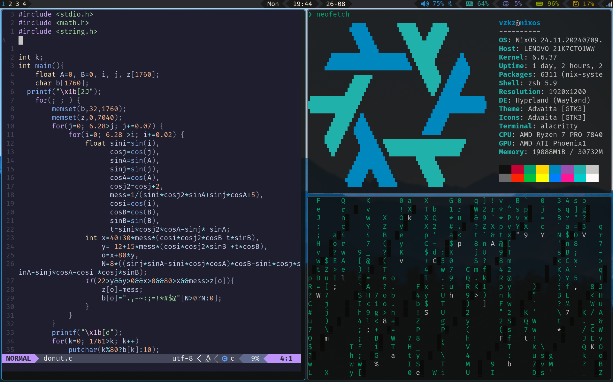
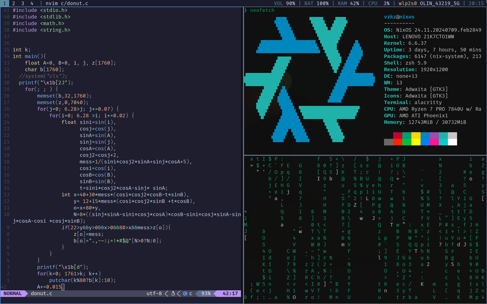

# Welcome to my Dotfiles!

## Tech Stack
- Hyprland Tiling Window Manager.
  - [waybar](https://github.com/Alexays/Waybar): Customizable status bar.
  - [hypridle](https://github.com/hyprwm/hypridle): Idle daemon.
  - [hyprlock](https://github.com/hyprwm/hyprlock/): GPU-accelerated screen locking utility.
  - [hyprpaper](https://github.com/hyprwm/hyprpaper): Wallpaper utility with IPC controls.
  - [hyprshot](https://github.com/Gustash/hyprshot): Utility to easily take screenshots in Hyprland.
- i3 Tiling Window Manager.
  - [Picom](https://github.com/yshui/picom): A lightweight compositor for X.
  - [Polybar](https://github.com/polybar/polybar): A fast and easy-to-use status bar.
  - [Rofi](https://github.com/davatorium/rofi): A window switcher, application launcher and dmenu replacement.
  - [feh](https://feh.finalrewind.org/): Terminal Image viewer.
-  Nvim: Modern, open-source text editor based on Vim. Configured using [Lazy.nvim](https://github.com/folke/lazy.nvim) plugin manager.
    - [Catppuccion theme](https://github.com/catppuccin/nvim).
    - [Lualine](https://github.com/nvim-lualine/lualine.nvim).
    - [Neotree](https://github.com/nvim-neo-tree/neo-tree.nvim).
    - [Telscope](https://github.com/nvim-telescope/telescope.nvim).
    - [Treesitter](https://tree-sitter.github.io/tree-sitter/).
    - [Vimtex](https://github.com/lervag/vimtex).
    - [nvim-lspconfig](https://github.com/neovim/nvim-lspconfig) in combination with nix packages to make LSP work correctly (implemented for Lua, Rust, C, C++ and Kotlin).
    - [None-ls](https://github.com/nvimtools/none-ls.nvim) to use Neovim as a language server to inject LSP diagnostics (linting) and formatting.
    - [nvim-cmp](https://github.com/hrsh7th/nvim-cmp).
    - [luasnip](https://github.com/L3MON4D3/LuaSnip).
    - [cmp_luasnip](https://github.com/saadparwaiz1/cmp_luasnip).
    - [friendly-snippets](https://github.com/rafamadriz/friendly-snippets).
    - [cmp-nvim-lsp](https://github.com/hrsh7th/cmp-nvim-lsp).
    - [nvim-dap](https://github.com/mfussenegger/nvim-dap) and [nvim-dap-ui](https://github.com/rcarriga/nvim-dap-ui) for debugging.
    - [gitsigns](https://github.com/lewis6991/gitsigns.nvim) and [vim-fugitive](https://github.com/tpope/vim-fugitive) for git integration with nvim.
    - [nvim-tmux-navigator](https://github.com/alexghergh/nvim-tmux-navigation) for tmux integration with nvim.
-  Terminal.
    - [Kitty](https://github.com/kovidgoyal/kitty): Cross-platform, GPU based terminal. 
    - [Zsh and OhMyZsh](https://ohmyz.sh): Shell for Unix-like operating systems and framework for managing your Zsh configuration.
    - [Starship](https://starship.rs/): Minimal, customizable prompt.
    - [Tmux ](https://github.com/tmux/tmux): Terminal multiplexor.
## Pre-requisites
- A machine with a fresh Nix operating system installed.
## Installation
- Clone this reposistory in your /home/ directory: ` git clone https://github.com/Jaimevzkz/Linux-Nixos-Config.git`.
- Copy your hardware configuration to this repository (replacing de one that exists): `cp /etc/nixos/hardware-configuration.nix ~/Linux-Nixos-Config/`.
- Adapt the specific data from the native `configuration.nix` of you computer to the `machine-specific.nix` file (stateVersion, etc...).
- run the command to rebuild your system using the flake.nix: `sudo nixos-rebuild switch --flake ~/Linux-Nixos-Config/#nixos-config`.
- [Optional] Change the directory name to be called nixos (to make the alias `update` work): `mv ~/Linux-Nixos-Config/ ~/nixos/`.
- Reboot your system and use gdm to choose between hyprland and i3 Tiling window manager: `sudo reboot`.
- With the above steps you should have a fully fuctional Linux-Nixos distribution, that's right, just like that!
## Credits
A lot of the code and inspiraton of this repository has been developed following videos of the content creator [Typecraft](https://www.youtube.com/@typecraft_dev). 
