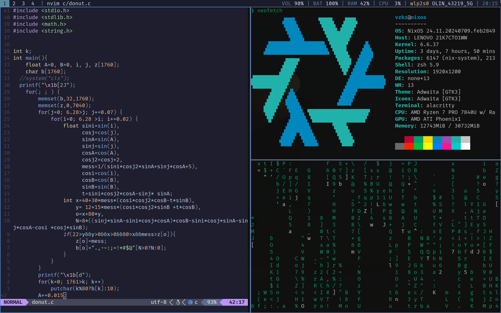

# Welcome to my Dotfiles!

## Tech Stack
- i3 Tiling Window Manager
  - [Picom](https://github.com/yshui/picom): A lightweight compositor for X.
  - [Polybar](https://github.com/polybar/polybar): A fast and easy-to-use status bar.
  - [Rofi](https://github.com/davatorium/rofi): A window switcher, application launcher and dmenu replacement.
  - [feh](https://feh.finalrewind.org/): Terminal Image viewer.
-  Nvim: Modern, open-source text editor based on Vim. Configured using [Lazy.nvim](https://github.com/folke/lazy.nvim) plugin manager.
  - [Catppuccion theme](https://github.com/catppuccin/nvim).
  - [Lualine](https://github.com/nvim-lualine/lualine.nvim).
  - [Neotree](https://github.com/nvim-neo-tree/neo-tree.nvim).
  - [Telscope](https://github.com/nvim-telescope/telescope.nvim)
  - [Treesitter](https://tree-sitter.github.io/tree-sitter/)
  - [Vimtex ](https://github.com/lervag/vimtex)
-  Terminal
  - [Alacritty](https://github.com/alacritty/alacritty): Cross-platform terminal emulator. 
  - [Zsh an OhMyZsh](https://ohmyz.sh): Shell for Unix-like operating systems and framework for managing your Zsh configuration.
  - [Starship](https://starship.rs/): Minimal, customizable prompt.
  - [Tmux ](https://github.com/tmux/tmux): Terminal multiplexor.
## Pre-requisites
- A system with a fresh Nix operating system installed
## Installation
- Clone this reposistory in your /home/ directory: ` git clone https://github.com/Jaimevzkz/Linux-Nixos-Config.git`.
- Copy your hardware configuration to this repository: `cp /etc/nixos/hardware-configuration.nix ~/Linux-Nixos-Config/`
- run the command to rebuild your system using the flake.nix: `sudo nixos-rebuild switch --flake ~/Linux-Nixos-Config/#nixos-config`
- [Optional] Change the directory name to be called nixos (to make the alias `update` work): `mv ~/Linux-Nixos-Config/ ~/nixos/`
- Reboot your system and use gdm to open i3 Tiling window manager: `sudo reboot`
- With the above steps you should have a fully fuctional Linux-Nixos distribution, that's right, just like that!
## Credits
A lot of the code and inspiraton of this repository has been developed following the videos of the content creator [Typecraft]{https://www.youtube.com/@typecraft_dev}. [Medium articles]{https://medium.com/} have been really helpful for erro troubleshooting and customization. 
